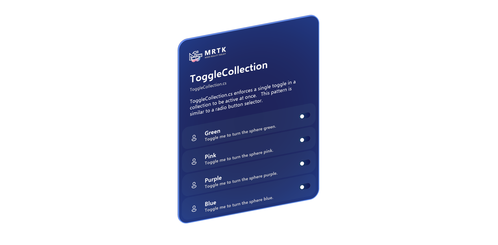

# Toggle Collection &#8212; MRTK3

ToggleCollection provides a simple mechanism for grouping multiple [StatefulInteractable](../../../mrtk3-overview/architecture/interactables.md)s together and enforcing an exclusive toggle state. This follows the [radio button pattern](https://en.wikipedia.org/wiki/Radio_button), and is implemented similarly to Unity UI's [ToggleGroup](https://docs.unity3d.com/Packages/com.unity.ugui@1.0/manual/script-ToggleGroup.html).

Similar to the Unity UI ToggleGroup, `ToggleCollection` automatically groups and manages all `StatefulInteractable` children. On the other hand, if you'd like to manually specify which Interactables are managed by the group, the `Toggles` list can manually populated in the inspector. When left blank, `ToggleCollection` will automatically populate the list.

When a managed `StatefulInteractable` is toggled, all other Interactables in the `Toggles` list are detoggled with `ForceSetToggled`. Toggle events will fire on each Interactable.

**Allow Switch Off** corresponds to the **Selection Mode** on each Interactable; when the option is checked, each Interactable is set to `Toggle`. When unchecked, each Interactable is configured to `One-way Toggle`.

Subscribe to the `OnToggleSelected` event to receive callbacks with the index of the choice as the parameter.