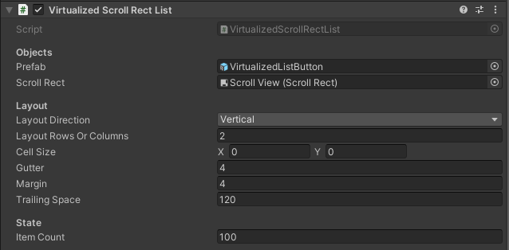

# Virtualized List

The `VirtualizedScrollRectList` is a helper component that allows you to represent very large lists in `ScrollRects` without paying the cost for a very large number of GameObjects. This works by maintaining a number of GameObjects that completely cover the visible area of the `ScrollRect`, and reusing and repositioning them as the list scrolls up and down.

Using this is not quite as simple as adding it as a component to your `ScrollRect`, it also requires a bit of code to get going. Here's what you need to do:
* Call `VirtualizedScrollRectList.SetItemCount` to let it know how many items are in the virtualized list.
* Add your callbacks to `OnVisible` and `OnInvisible`, so you can populate the prefab with the data associated with the provided index.
* Update `VirtualizedScrollRectList`'s representation of the Item Count as your list changes over time.

> [!NOTE]
> `VirtualizedScrollRectList` recycles all of the GameObjects in the pool, and relies on you to (re)set any changes to the prefab with callbacks to the `OnVisible` and `OnInvisible`. In other words, the changes you make to the GameObject are not cleared by `VirtualizedScrollRectList`.

### Prefab

You can set the desired prefab in the inspector. Every GameObject in the list will be an instance of this prefab.

An example can be found in the `VirtualizedScrollRectList` scene.
