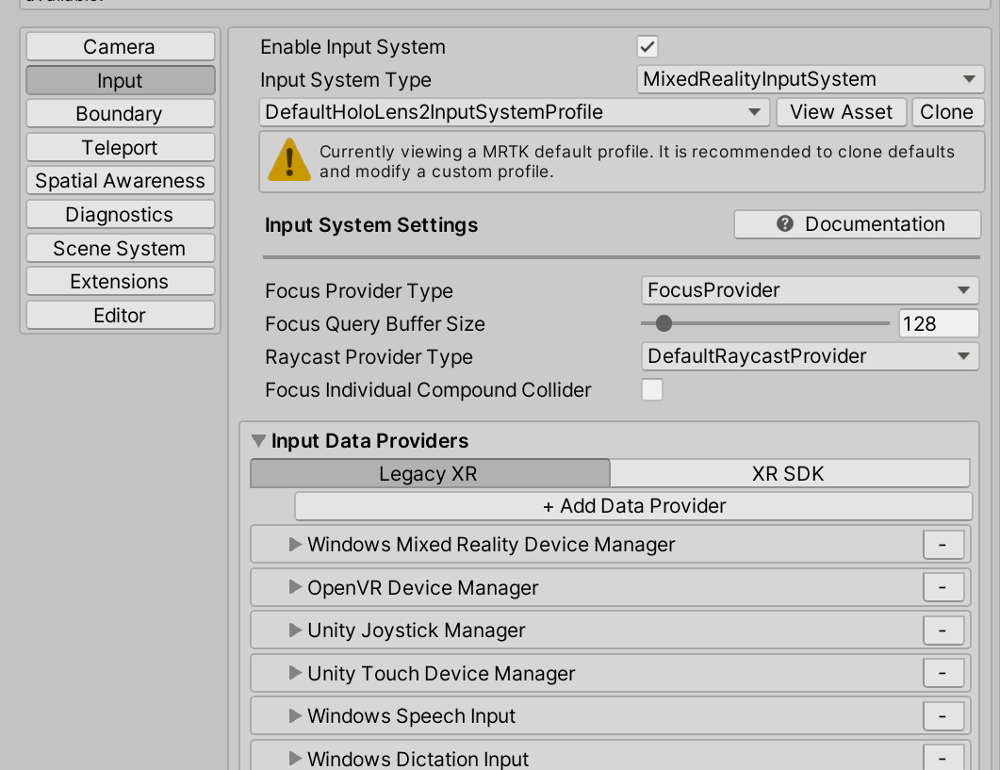
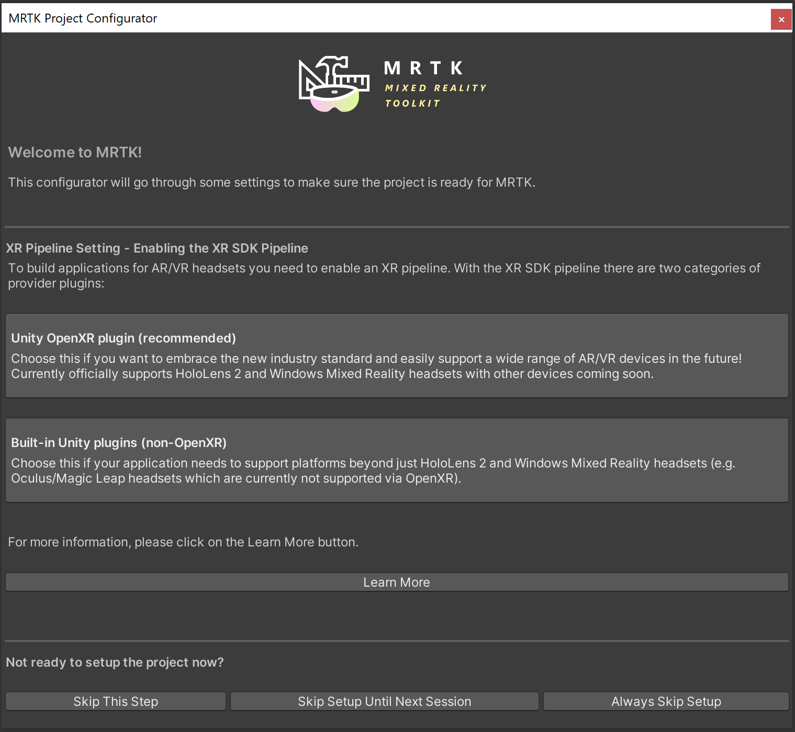
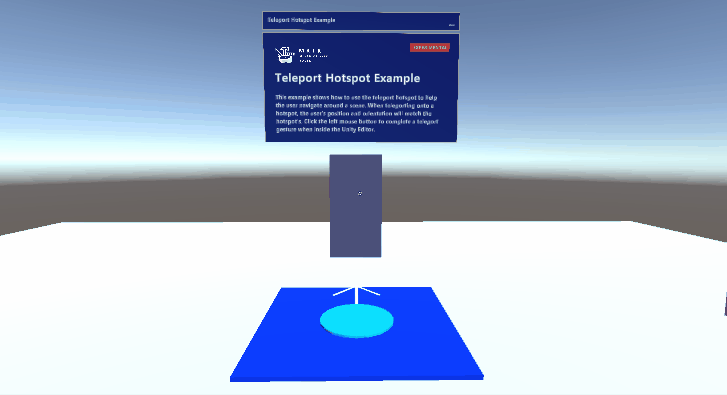
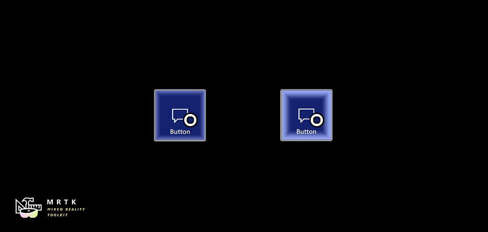

# Microsoft Mixed Reality Toolkit 2.7.0 Release Notes

## What's new in 2.7.0

### Legacy XR and XR SDK Data Providers can now be used within the same profile

Data providers will now also only be loaded when the appropriate pipeline is selected, allowing both Legacy XR and XRSDK data providers to co-exist within 
the same profile. To accommodate this, Legacy XR and XR SDK Data Providers are now organized under different tabs within the profile view, helping users 
determine whether they have the correct profile for their targeted XR pipeline.



To accommodate this null data providers will now no longer be loaded and displayed in the profile inspector. Users can toggle `Show null data providers in the profile inspector`
under **Edit -> Project Settings -> Mixed Reality Toolkit** to debug unexpected behaviors with missing data providers.


### Added Experience Settings and an associated Mixed Reality Scene Content behavior

Users can now configure [Experience Settings](../features/experience-settings/experience-settings.md), which will allow MRTK to display [Mixed Reality Scene Content](../features/experience-settings/scene-content.md)
appropriately based on the targeted experience.

If user's previous Experience Scale settings do not match the new Experience Settings Profile, they will be prompted to correct it in the inspector


### The Redesigned Configurator now guides the user through the setup process

The new MRTK configurator provides users step-by-step guidance to properly configure the project for XR development and use with MRTK. It covers the selection of XR pipeline, getting the platform specific plugins, importing TextMeshPro, displaying the examples (when using UPM) and other previously included recommended settings for the project.



### Graduated Teleport Hotspot

A new teleport hotspot component has been graduated. You can add a teleport hotspot to your GameObject to ensure that the user is in a certain position and orientation when they teleport to that location.



### Graduated Dwell

The dwell feature and example is now graduated from experimental. New examples of volumetric HoloLens 2 style buttons are included in the sample scene.



### Added support for Leap Motion Unity Modules version 4.6.0, 4.7.0, 4.7.1 and 4.8.0

Support for the latest versions of the [Leap Motion Unity Modules](https://developer.leapmotion.com/unity) is now compatible with MRTK 2.7.0.  See [How to Configure MRTK for Leap Motion](../features/cross-platform/leap-motion-mrtk.md) for more information. 

Big thanks to @jackyangzzh for contributing the new LeapMotionOrientationExample scene!

### Targeted speech events raised no longer restricted to gaze pointers.

Previously, targeted speech events could only be raised on objects which were focused on with the gaze pointer. Now, objects can receive speech events if they are focused by any pointer.


### Ported TextToSpeech from HTK to MRTK

The beloved TextToSpeech script is now finally available in MRTK to help you generate speech from text on the UWP platform using [`SpeechSynthesizer`](https://docs.microsoft.com/uwp/api/windows.media.speechsynthesis.speechsynthesizer). Also added a sample scene to demonstrate the feature.

### Notable Bugfixes and Changes

- Pinch detection made smoother. It is now harder to accidentally drop the pinch gesture. [#9576](https://github.com/microsoft/MixedRealityToolkit-Unity/pull/9576)
- Objects with the Object Manipulator component now consistently maintain velocity on release when the flag is set. [#9733](https://github.com/microsoft/MixedRealityToolkit-Unity/pull/9733)
- Backstrafing now checks for a floor, helping prevent situations where the camera can clip into the environment or where the user is left hovering over empty space.[#9697](https://github.com/microsoft/MixedRealityToolkit-Unity/pull/9697)
- IsNearObject is now a virtual property, allowing more flexibility when extending the sphere or poke pointer. [#9803](https://github.com/microsoft/MixedRealityToolkit-Unity/pull/9803)
- Buttons now display the proper keyword when showing the available speech command. [#9824](https://github.com/microsoft/MixedRealityToolkit-Unity/pull/9824)
- Oculus Controllers now uses it's own standalone visualizer, preventing the MRTK visualization from clashing with the Oculus Integration Package's visualization. [#9589](https://github.com/microsoft/MixedRealityToolkit-Unity/pull/9589)
- Keyboard related scripts have been changed to align with the behavior in latest Unity versions (2019.4.25+ & 2020.3.2+). As of the release there is still an auto-completion bug and a TMP Input Field bug (both are external to MRTK) impacting HoloLens. For more information please see [#9056](https://github.com/microsoft/MixedRealityToolkit-Unity/pull/9056) and [#9724](https://github.com/microsoft/MixedRealityToolkit-Unity/pull/9724).
- Improved the performance of Scrolling Object Collection. Also fixed an issue causing GameObject within the collection to lose material when duplicated. [#9813](https://github.com/microsoft/MixedRealityToolkit-Unity/pull/9813), [#9718](https://github.com/microsoft/MixedRealityToolkit-Unity/pull/9718)
- In the Scene Understanding demo script, added the `GetSceneObjectsOfType` function to retrieve all observed scene object of a certain kind. [#9524](https://github.com/microsoft/MixedRealityToolkit-Unity/pull/9524), [#9744](https://github.com/microsoft/MixedRealityToolkit-Unity/pull/9744)
- In command line build tool, only scenes specified by the `sceneList` or `sceneListFile` flags (when any flag is present) will be included in the build. [#9695](https://github.com/microsoft/MixedRealityToolkit-Unity/pull/9695)
- In build tool, there is a new option to specify a path to `nuget.exe` and use that to perform package restore instead of using `msbuild` (the default option). [#9556](https://github.com/microsoft/MixedRealityToolkit-Unity/pull/9556)


## Known Issues

### MRTK build window triggers indefinite "Importing assets" dialog in Unity 2020.3

There is a known [issue](https://github.com/microsoft/MixedRealityToolkit-Unity/issues/9723) with the MRTK build window on Unity 2020.3 where after successfully performing a UWP build, the "Importing assets" dialog does not complete. This issue is being investigated in partnership with Unity. 

### Text Mesh Pro Canvas Renderer warnings in Unity 2020

The following warning is logged in most MRTK example scenes while using Unity 2020:

```
Please remove the CanvasRenderer component from the [TextMeshPro] GameObject as this component is no longer necessary.
```

The Canvas Renderer warning was added in [TextMeshPro version 3.0.3](https://docs.unity3d.com/Packages/com.unity.textmeshpro@3.0/changelog/CHANGELOG.html#changes-3).  These warning do not have an impact on MRTK's example scenes and can be cleared from the console. See [Issue 9811](https://github.com/microsoft/MixedRealityToolkit-Unity/issues/9811) for more details. 
