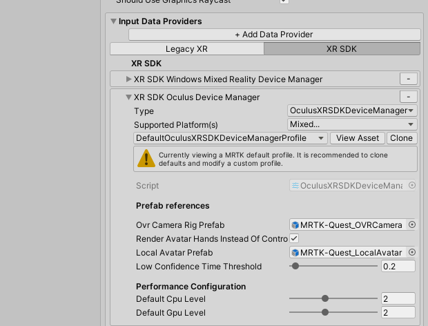

# Controllers in MRTK

MRTK has support for many different controllers. Many controllers, such as HTC Vive Knuckles and HTC Vive Wands, will work natively once an application built with MRTK is launched on the compatible device. Other controllers, such as articulated hands on the Oculus Quest and the HP Reverb G2 Controllers, require additional packages before they are recognized by MRTK.

This document will describe the common scenarios where extra packages need to be installed. For instructions on how to deploy to your device, see the [**Hololens/WMR**](/windows/mixed-reality/mrtk-unity/supported-devices/wmr-mrtk) or [**Oculus Quest**](/windows/mixed-reality/mrtk-unity/supported-devices/oclus-quest-mrtk) deployment pages. For additional information about controllers, visit the [**features page**](../features/input/controllers.md). To debug issues with controllers, see the [**Controller mapping tool**](../features/tools/controller-mapping-tool.md)

## HP Reverb G2 Controllers

To detect and show the HP Reverb G2 controllers when using MRTK, follow these steps to install the [**Microsoft.MixedReality.Input**](/windows/mixed-reality/develop/unity/unity-reverb-g2-controllers#installing-microsoftmixedrealityinput-with-the-mixed-reality-feature-tool) package. Once this package is installed, no other changes to the default profiles need to be made to have the controllers show up on the HP Reverb. 

In order to display the controllers in editor, you need to ensure that you are using the using the [**OpenXR Plugin**](/windows/mixed-reality/develop/unity/openxr-getting-started).

## Oculus Controllers 

To visualize Oculus controller models, follow the Oculus Quest deployment instructions. If you wish to show virtual hands when using the controllers, make sure that **Render Avatar Hands Instead Of Controllers** is checked under the XR SDK Oculus Device Manager. Otherwise, uncheck this option.

