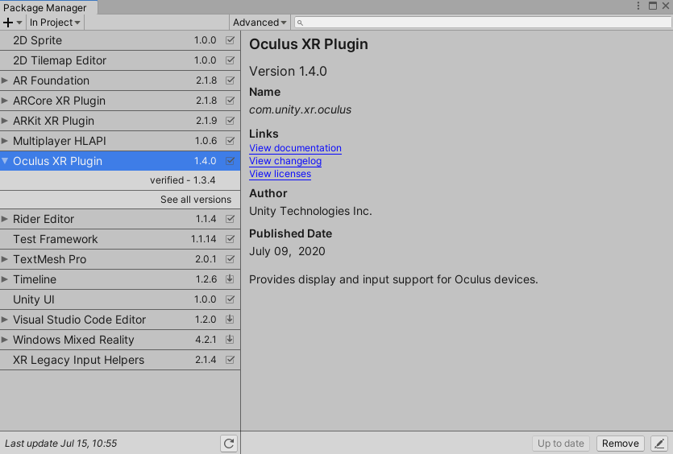
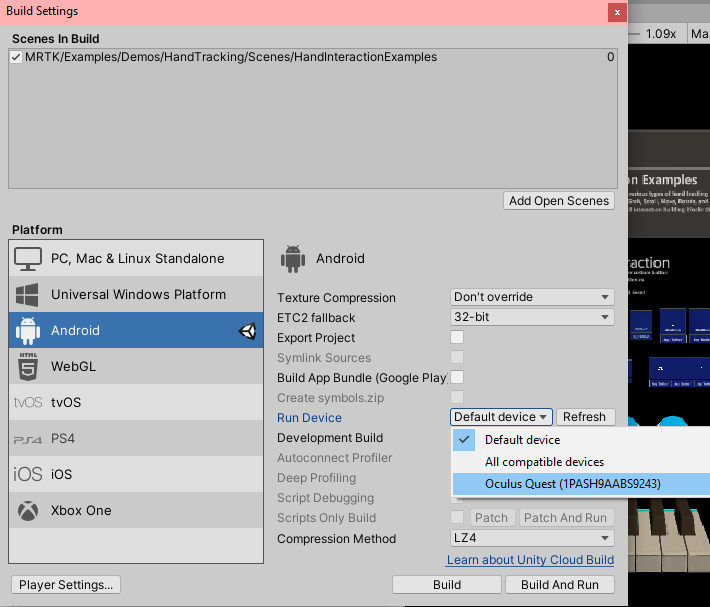

# Building and deploying MRTK to Oculus Quest using the XR SDK pipeline

An [Oculus Quest](https://www.oculus.com/quest/) is required.

MRTK's support for the Oculus Quest comes via two different sources, Unity's XR SDK pipeline and the Oculus Integration Unity package. The **Oculus XRSDK Data Provider** enables the use of both sources and must be used to deploy MRTK on the Oculus Quest.

The [Unity XR SDK Pipeline](https://docs.unity3d.com/Manual/XR.html) enables the use of Oculus Touch controllers and head tracking with the Oculus Quest.
This pipeline is the standard for developing XR applications in Unity 2019.3 and beyond. To use this pipeline, make sure that you using **Unity 2019.3 or newer**. This is **required** to deploy MRTK applications to the Oculus Quest. 

The [Oculus Integration Unity package](https://assetstore.unity.com/packages/tools/integration/oculus-integration-82022) allows for the use of **hand tracking** with the Oculus Quest. This data provider does **NOT** use Unity's **XR SDK Pipeline** or **Legacy XR Pipeline**.

## Setting up project for the Oculus Quest

1. Follow [these steps](https://developer.oculus.com/documentation/unity/book-unity-gsg/) to ensure that your project is ready to deploy on Oculus Quest.

1. Ensure that [developer mode](https://developer.oculus.com/documentation/native/android/mobile-device-setup/) is enabled on your device. Installing the Oculus ADB Drivers is optional.

## Setting up the XR SDK Pipeline for Oculus Quest

1. Ensure that the **Oculus XR Plugin** is installed under **Window --> Package Manager**

    

1. Make sure that the Oculus Plug-in Provider is included in your project by going to **Edit --> Project Settings --> XR Plug-in Management --> Plug-in Providers**

    

## Setting up the Oculus Integration Unity package to enable handtracking

1. Download and import [Oculus Integration](https://assetstore.unity.com/packages/tools/integration/oculus-integration-82022) from the Unity Asset Store. The latest version tested to
work is 20.0.0. Older versions can be found from this [archive](https://developer.oculus.com/downloads/package/unity-integration-archive/)

1. Navigate to Mixed Reality Toolkit > Utilities > Oculus > Integrate Oculus Integration Unity Modules. Doing this will update the asmdefs with definitions and references needed for the
relevant Oculus Quest code to function. It will also update the csc file to filter out the obsolete warnings produced by the Oculus Integration assets. The MRTK repo contains a csc file that converts warnings to errors, this conversion halts the MRTK-Quest configuration process.

    

1. In the imported Oculus folder (It should be found at Assets/Oculus), there is a scriptable object called OculusProjectConfig. In that config file, you need to set HandTrackingSupport
to "Controllers and Hands".

    

## Setting up the scene

1. Create a new Unity scene or open a pre-existing scene like HandInteractionExamples
1. Add MRTK to the scene by navigating to **Mixed Reality Toolkit** > **Add to Scene and Configure**

## Using the Oculus XR SDK Data Provider

1. Configure your profile to use the **Oculus XR SDK Data Provider**
    - If not intending to modify the configuration profiles
::: moniker range=">= mrtkunity-2021-05"
        - Use any of the default MRTK profiles, which are all configured across Unity's XR pipelines. The previous DefaultXRSDKConfigurationProfile is now labeled obsolete.
::: moniker-end
::: moniker range="< mrtkunity-2021-05"
        - Change your profile to DefaultXRSDKConfigurationProfile.
::: moniker-end
        - Go to [Build and deploy your project to Oculus Quest](oculus-quest-mrtk.md#build-and-deploy-your-project-to-oculus-quest).

    - Otherwise follow the following:
        - Select the MixedRealityToolkit game object in the hierarchy and select **Copy and Customize** to clone the default mixed reality profile.

        

        - Select the **Input** Configuration Profile

        

        - Select **Clone** in the input system profile to enable modification.

        

        - Open the **Input Data Providers** section, select **Add Data Provider** at the top, and new data provider will be added at the end of the list.  Open the new data provider and set the **Type** to **Microsoft.MixedReality.Toolkit.XRSDK.Oculus > OculusXRSDKDeviceManager**

        

1. The Oculus XR SDK Data Provider includes an OVR Camera Rig Prefab which automatically configures the project with an OVR Camera Rig and OVR Hands to properly route input. Manually adding an OVR Camera Rig to the scene will require manual configuration of settings and input.

## Build and deploy your project to Oculus Quest

1. Plug in your Oculus Quest via a USB 3.0 -> USB C cable
1. Navigate to **File > Build Settings**
1. Change the deployment to **Android**
1. Ensure that the Oculus Quest is selected as the applicable run device

    

1. Select Build and Run
    - You will likely encounter the following set of build errors when you select *Build and Run* the first time. You should be able to successfully deploy upon selecting *Build and Run* again.

    

1. Accept the _Allow USB Debugging_ prompt from inside the quest
1. See your scene inside the Oculus Quest

## Removing Oculus Integration from the Project

1. Navigate to the Mixed Reality Toolkit > Oculus > Separate Oculus Integration Unity Modules
    
1. Let Unity refresh as references in the Microsoft.MixedReality.Toolkit.Providers.Oculus.asmdef and other files are modified in this step
1. Close Unity
1. Close Visual Studio, if it's open
1. Open File Explorer and navigate to the root of the MRTK Unity project
1. Delete the UnityProjectName/Library directory
1. Delete the UnityProjectName/Assets/Oculus directory
1. Delete the UnityProjectName/Assets/Oculus.meta file
1. Reopen Unity

## Common errors

### Quest not recognized by Unity

Make sure your Android paths are properly configured. If you continue to encounter problems, follow this [guide](https://developer.oculus.com/documentation/unity/book-unity-gsg/#install-android-tools)

**Edit > Preferences > External Tools > Android**

