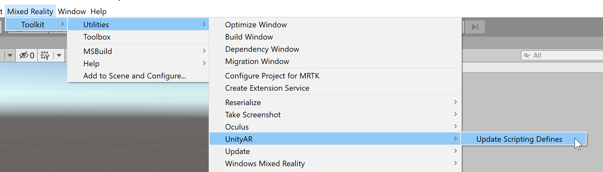
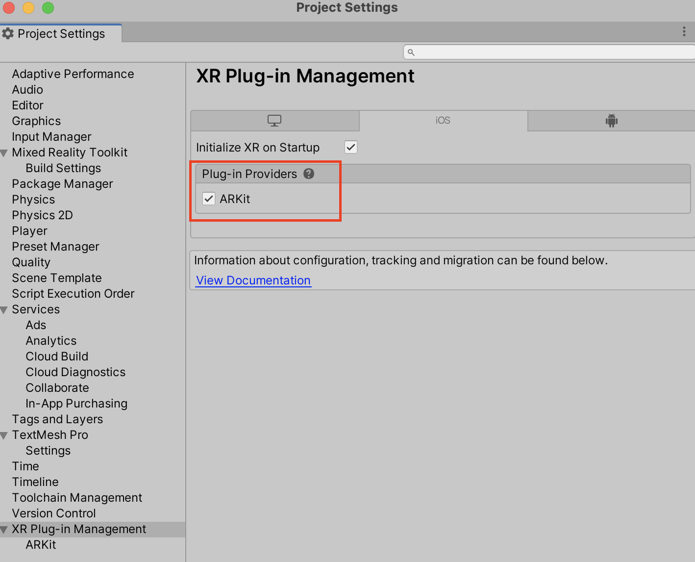

# Deploying to Android and iOS (AR Foundation) [Experimental]

## Install required packages

1. Download and import the **Microsoft.MixedReality.Toolkit.Unity.Foundation** package, from [GitHub](https://github.com/microsoft/MixedRealityToolkit-Unity/releases/) or the [Unity Package Manager](../configuration/usingupm.md)

1. In the Unity Package Manager (UPM), install the following packages:

    **Unity 2018.4.x**

    | **Android** | **iOS** | Comments |
    | --- | --- | --- |
    | AR Foundation    Version: 1.5.0 - preview 6 | AR Foundation    Version: 1.5.0 - preview 6 | For Unity 2018.4, this package is included as a preview. To view the package: `Window` > `Package Manager` > `Advanced` > `Show Preview Packages` |
    | ARCore XR Plugin   Version: 2.1.2 | ARKit XR Plugin   Version: 2.1.2 | |

    **Unity 2019.4.x**

    | **Android** | **iOS** |
    | --- | --- |
    | AR Foundation    Version: 2.1.8 |  AR Foundation    Version: 2.1.8 |
    | ARCore XR Plugin   Version: 2.1.11 | ARKit XR Plugin   Version: 2.1.9 |

    **Unity 2020.3.x**

    | **Android** | **iOS** |
    | --- | --- |
    | AR Foundation    Version: 3.1.3 |  AR Foundation    Version: 4.0.12 |
    | ARCore XR Plugin   Version: 3.1.4 | ARKit XR Plugin   Version: 4.1.7 |

1. Update the MRTK UnityAR scripting defines by invoking the menu item: **Mixed Reality > Toolkit > Utilities > UnityAR > Update Scripting Defines**

    

## Add the MixedRealityToolKit scene to your project

1. Select Mixed Reality -> Toolkit -> Add to scene and configure   

## Enabling the Unity AR camera settings provider

The following steps presume use of the MixedRealityToolkit object. Steps required for other service registrars may be different.

1. Select the MixedRealityToolkit object in the scene hierarchy.

    

1. Select **Copy and Customize** to Clone the MRTK Profile to enable custom configuration.

    

1. Select **Clone** next to the Camera Profile.

    

1. Navigate the Inspector panel to the camera system section and expand the **Camera Settings Providers** section.

    

1. Click **Add Camera Settings Provider** and expand the newly added **New camera settings** entry.

    

1. Select the Unity AR Camera Settings provider

    

    For more information about configuring the Unity AR camera settings provider: [Unity AR camera settings provider](../features/camera-system/unity-ar-camera-settings.md).

> [!NOTE]
> This installation checks (when the application starts) if the AR Foundation components are in the scene. If not, they are automatically added to make it work with ARCore and ARKit.
> If you need to set a specific behaviour, you should add the components you need by yourself.
> For more information about AR Foundation components and installation, check this [documentation](https://docs.unity3d.com/Packages/com.unity.xr.arfoundation@2.2/manual/index.html#samples).

## Building a scene for Android and iOS devices

1. Make sure you have added the UnityAR Camera Settings Provider to your scene.

1. Switch platform to either Android or iOS in the Unity Build Settings

1. Ensure the associated XR Plug-in management provider is enabled

    iOS XR Plug-in Management:
    

1. Build and run the scene

## See also

- [Unity AR Camera Settings](../features/camera-system/unity-ar-camera-settings.md)
