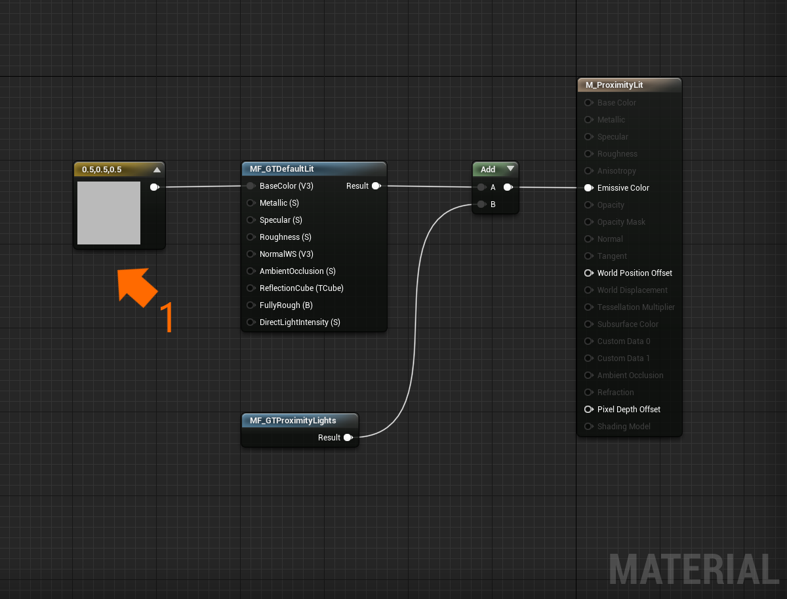

# Proximity Lights

A proximity light is a [Fluent Design System](https://www.microsoft.com/design/fluent) paradigm that mimics a [point light](https://docs.unrealengine.com/en-US/BuildingWorlds/LightingAndShadows/LightTypes/Point/index.html) projected onto a surface with a color gradient. Often used for near interactions, an app can control the location and properties of a proximity light via the `GTProximityLight` component (or actor). To utilize proximity lights on a [material](https://docs.unrealengine.com/en-US/RenderingAndGraphics/Materials/index.html), place the `MF_GTProximityLights` [material function](https://docs.unrealengine.com/en-US/RenderingAndGraphics/Materials/Functions/index.html) within a material and assign the output to the material's emissive color.


> [!NOTE] 
> Up to three proximity lights can effect a material at once. Additional proximity lights will not be included in light calculations.

Another unique feature of proximity lights is that they can pulse to draw attention. To pulse a proximity light call the `Pulse` member function via Blueprint or C++. 

## Example level

There are some demonstrations of proximity lights within the `\GraphicsToolsProject\Plugins\GraphicsToolsExamples\Content\ProximityLights\ProximityLights.umap` level.

## Example usage

In the following steps we will create a new material that is illuminated by a proximity light.

1. First we will create a material.
    * Right click within the "Content Browser" and select "Material" under the "Create Basic Asset" menu listings. 
    * Let's name our material `M_ProximityLit`. 
    * Double click on `M_ProximityLit` to open the material editor. 

2. It's good practice to keep your materials simple (in other words keep the number of shader instructions low) when authoring materials for Mixed Reality. 
    * To ensure this, mark `M_ProximityLit` as "Unlit" (1) in the material's "Shading Model" property. 
    * (Optional) If you would like your material to still look as though it is lit, then right click on the material graph and add the `MF_GTDefaultLit` material function. 
    * Connect the result of the `MF_GTDefaultLit` to the material's "Emissive Color." (2)

    

3. Our material now needs to add proximity light calculations. 
    * To do this right click on the material graph and add the `MF_GTProximityLights` material function (1). 
    * Connect the result of `MF_GTProximityLights` to the material's "Emissive Color." If your material is also using the `MF_GTDefaultLit` material function (from step 3) then add the result from both functions before connecting the result to the material's "Emissive Color." (2)

    

4. Next let's give our material a base color. Very few materials exist in the real world are completely black (and completely black materials render transparently on additive displays like the one found on HoloLens 2). 
    * Right click on the material graph and add a `ConstantVector3` node. 
    * Set the node's RGB channels to 0.5, a neutral gray color. 
    * Connect this node to the `BaseColor` input of the `MF_GTDefaultLit` material function. (1)

    

5. It's time to preview our material interacting with a proximity light. 
    * First let's create a new level (File > New Level) and select "Empty Level." 
    * From the "Place Actors" panel drop a `Sphere` actor into the level. 
    * With the `Sphere` actor selected change the material to our newly created material, `M_ProximityLit`. 
    * (Optional) Scale the sphere down to about 25% so that it's not so large.

    

6. You may notice now that our `Sphere` actor is completely black and can't be differentiated from the background. To fix this let's add a directional light to our scene. Because we are using the `MF_GTDefaultLit` material function we must use a `GTDirectionalLight` actor (or component). 
    * From the "Place Actors" panel drop a `GTDirectionalLight` actor into the level. 
    * Set the `GTDirectionalLight`'s "Intensity" to 2. The default value represents a "sunny day" and may wash out our proximity light. More information about the `GTDirectionalLight` component can be found in the [lighting](Lighting.md) documentation.

7. Finally it's time to add a proximity light to the level. 
    * From the "Place Actors" panel drop a `GTProximityLight` actor into the level. 
    * Move the `GTProximityLight` actor around until it hovers near the surface of the the `Sphere` actor. You will now see the proximity light illuminate the surface with a blue-purple gradient. (1) 
    * Try experimenting with different proximity light colors by changing the center, middle, and outer colors in the details panel of the proximity light. Or, try changing the size of proximity light via projected radius. 
    * If you want to hide the proximity light without removing the actor you can uncheck the "Visible" flag under the "Rendering" properties.

    

## Advanced usage

By default only three proximity lights can illuminate a material at a time. If your project requires an additional proximity light to influence a material the sample code below demonstrates how to achieve this.

> [!NOTE]
> Having many proximity lights illuminate a material will increase pixel shader instructions and will impact performance. Please profile these changes within your project.

*How to increase the number of available proximity lights from three to four.*

```C++
// 1) Within GraphicsToolsProject\Plugins\GraphicsTools\Source\GraphicsTools\Private\GTProximityLightComponent.cpp change:

#define GT_MAX_PROXIMITY_LIGHTS 3

// to:

#define GT_MAX_PROXIMITY_LIGHTS 4

// 2) Open GraphicsToolsProject\Plugins\GraphicsTools\Content\Materials\MF_GTProximityLights.uasset within the Unreal Editor. 
// With the `Contribution proximity lights` custom expression selected change the "Additional Defines" property from:

GT_MAX_PROXIMITY_LIGHTS 3

// to:

GT_MAX_PROXIMITY_LIGHTS 4
```

To add support for more than 4 lights the above changes must be made as well as the below changes.

1) Within the UpdateParameterCollection method in GTProximityLightComponent.cpp change each instance of ParameterNames (6 in total) to include a new entry. 

2) In the `MPC_GTSettings` [material parameter collection](https://docs.unrealengine.com/en-US/RenderingAndGraphics/Materials/ParameterCollections/index.html) add 6 new entries for all parameter names which were added above. 

3) In `GraphicsToolsProject\Plugins\GraphicsTools\Shaders\GTProximityLightingUnreal.ush` add additional function parameters to the `GTContributionProximityLights` function. 

4) Open `GraphicsToolsProject\Plugins\GraphicsTools\Content\Materials\MF_GTProximityLights.uasset` within the Unreal Editor and include the additional inputs in the `Contribution Proximity Lights` [custom expression](https://docs.unrealengine.com/en-US/RenderingAndGraphics/Materials/ExpressionReference/Custom/index.html). Finally, connect those inputs to the corresponding `MPC_GTSettings` parameters outputs.

## See also

- [Lighting](Lighting.md)
- [Effects](Effects.md)
